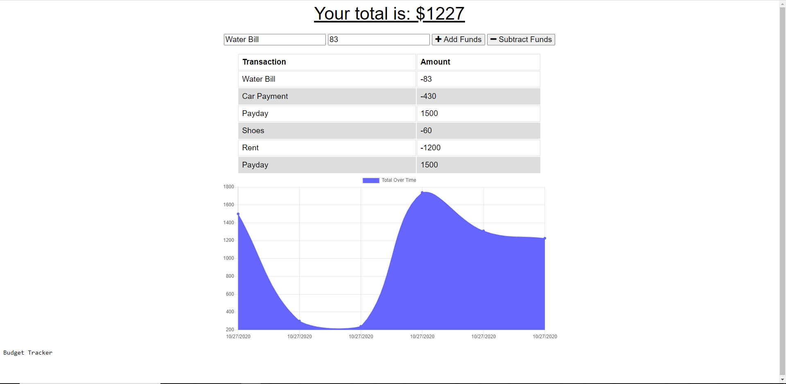

# Budget Tracker
  
  
  ## Description
  This is a financial transaction-tracking application that records money coming in and going out and can store the information offline.
  ## Table of Contents
  [usage](#Usage)
  [license](#License)
  [contributing](#Contributing)
  [tests](#Tests)
  [questions](#Questions)
  ## Usage
  Navigate to https://budget-tracker-0125.herokuapp.com/ and you may begin recording transactions.
  
  ## License
  This project is under the MIT license. 
  ## Contributing
  Please contact me if you would like to contribute to this project.
  ## Tests
  Upon adding transactions, disconnect the internet and add more. You will see the information persists offline. Reconnect and you can check in the developer's tools, accessible by right-clicking anywhere in the screen and selecting the "inspect" option, in the application tab, the database is clearly visible with all entries present.
  ## Questions
  If you have any questions, please feel free to contact me at
  [jonmakesitbetter@gmail.com](jonmakesitbetter@gmail.com) or see my GitHub at 
  [jonmakesitbetter](https://github.com/jonmakesitbetter/).